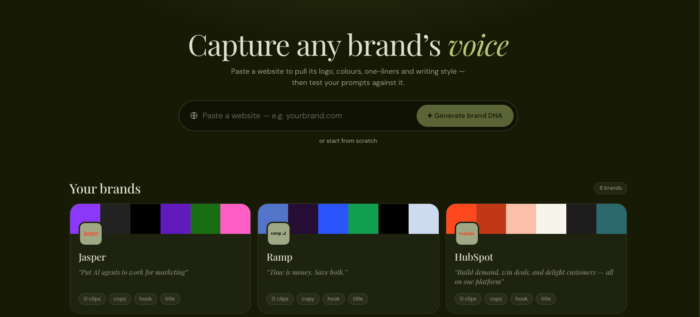
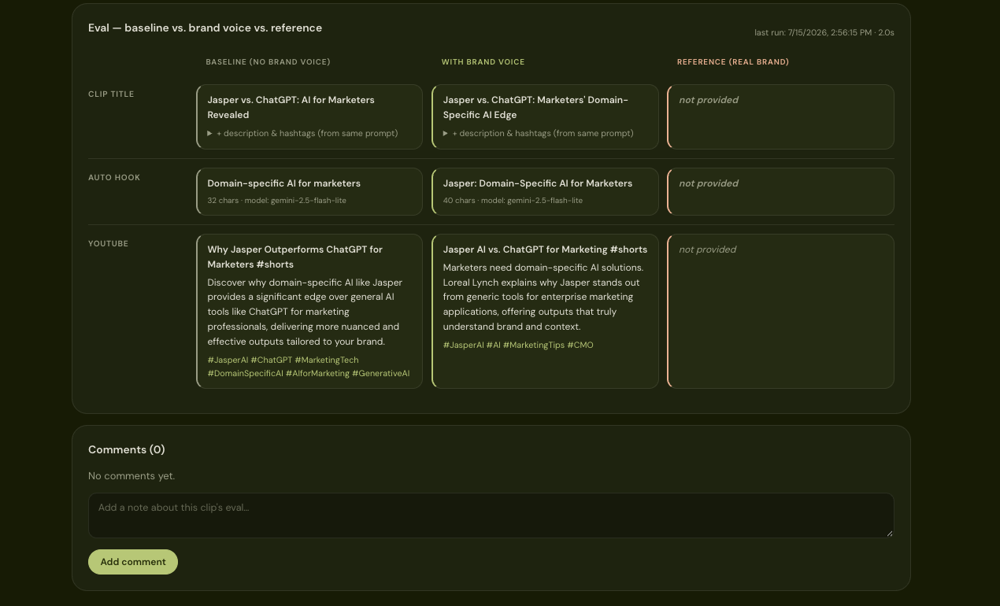
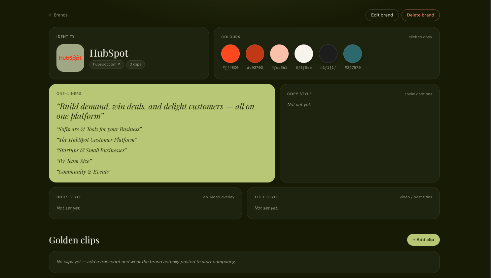
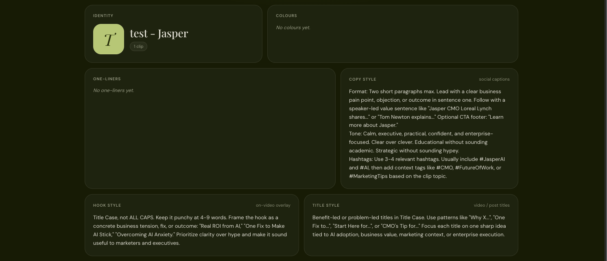

# Brand Voice Eval

A small evaluation harness for answering one question: **does a per-brand voice instruction actually make AI-written clip copy better?**

For each clip you add, it generates the same outputs twice — once with the standard prompt (**baseline**) and once with that prompt plus a brand voice instruction (**brand voice**) — and shows them side by side with the **reference** copy you'd consider ideal.



## What it does

- **Brands** hold three voice instructions (one each for social copy, hooks and titles) plus the brand's logo, colours and one-liners.
- **Generate brand DNA** fills all of that in from the brand's website, as editable cards. See [Generating a brand from its website](#generating-a-brand-from-its-website).
- **Clips** hold a title, a transcript (required), an optional video for viewing, and optional reference outputs.
- **Run eval** fires the prompts in parallel for both modes and stores the results.
- **Compare** baseline vs. brand voice vs. reference in a grid, and leave comments per clip.

Generated outputs per mode:

| Output | What it is | Model (primary → fallback) |
| --- | --- | --- |
| Clip title | Title, description and hashtags as JSON | `gemini-2.5-flash-lite` → `gpt-5-nano` |
| Auto hook | A short opening hook | `gemini-2.5-flash-lite` → `gpt-5-nano` |
| Social copy | Platform-specific title, description and hashtags | `gemini-2.5-flash` |

Social copy prompts exist for YouTube Shorts, TikTok, Instagram, LinkedIn, X/Twitter and Facebook. Only YouTube is switched on by default — change `ENABLED_SOCIAL_PLATFORMS` in `server/src/prompts.ts` to add more.



## Tech stack

- **Server:** Fastify, SQLite (`better-sqlite3`), the OpenAI SDK, `cheerio` for reading web pages, TypeScript (run with `tsx`)
- **Web:** React 18, React Router, Vite, TypeScript

## Getting started

Requires Node 20.18 or newer. Two processes: the API and the UI.

```bash
# terminal 1 — API on http://localhost:3001
cd server
npm install
npm run dev

# terminal 2 — UI on http://localhost:5173
cd web
npm install
npm run dev
```

Open <http://localhost:5173>. The Vite dev server proxies `/api` and `/uploads` to the API.

## Configuration

The server talks to an **OpenAI-compatible gateway** (the OpenAI SDK pointed at a custom base URL). Authentication is handled by the gateway, so there is no API key in this repo. Point it at your own gateway with environment variables:

| Variable | Purpose |
| --- | --- |
| `GATEWAY_URL` | Base URL of the OpenAI-compatible gateway |
| `GATEWAY_X_CALLER` | Value sent in the `X-Caller` header, for gateways that identify callers |
| `GATEWAY_X_TASK` | Value sent in the `X-Task` header, for per-task tracking |
| `PORT` | API port (default `3001`) |

```bash
GATEWAY_URL=https://your-gateway.example/openai/v1 GATEWAY_X_CALLER=<your-id> npm run dev
```

> The defaults in `server/src/gateway.ts` were written for the original private setup. Override them with your own values before running.

If requests fail with an auth error, check that your caller ID is registered with the gateway. Token limits are kept well under typical provider caps: 1024 for titles and social copy, 200 for hooks, 2048 for website analysis.

## Workflow

1. Create a brand: paste its website and press **Generate brand DNA**, or start from scratch and fill in the three voice fields (copy, hook, title) yourself.
2. Add clips: a title and transcript (required), plus an optional video and any reference outputs.
3. Open a clip and press **Run eval**. Title, hook and one social-copy prompt per enabled platform run in parallel, once for each mode.
4. Compare baseline, brand voice and reference side by side.
5. Leave comments on the clip.

Aim for **10 or more clips per brand** so patterns show up instead of one-off noise.

## Generating a brand from its website

Paste a URL and the server fetches the page and fills in the brand as a set of cards. Everything is editable, and nothing is saved until you press Create or Save.



The three voice cards hold the instructions the eval injects into each prompt:



| Card | Where it comes from |
| --- | --- |
| Logo | Ranked candidates from JSON-LD, the header / home-link image, touch icons and favicons. The form shows them all — click one to choose. |
| Colours | Up to 6, scored from the site's CSS (`theme-color`, brand-ish custom properties, backgrounds), with near-duplicates and near-whites removed. |
| One-liners | Taglines and selling points picked by the model, kept only if they appear verbatim on the page. Falls back to the page's headings when the gateway is unavailable. |
| Copy / hook / title style | Written by `gemini-2.5-flash` from the page's text. |

Good to know:

- The page is read as static HTML, so JavaScript-rendered sites yield little beyond their meta tags, and a logo drawn inline in the header falls back to the site icon.
- Logo and colours are heuristics — expect to fix one now and then.
- Without a reachable gateway you still get logo, colours and one-liners within a few seconds; the three voice cards stay empty with a note saying why.
- Only public http(s) addresses are fetched; loopback and private ranges are refused.

## Data model

SQLite file at `server/data.db`, created automatically.

| Table | Holds |
| --- | --- |
| `brands` | Name, the copy / hook / title instructions, plus website, logo URL, colours and one-liners |
| `clips` | Title, transcript, optional video filename, reference outputs, brand link |
| `eval_runs` | The JSON result of each eval run for a clip |
| `comments` | Free-text comments per clip |

Uploaded videos go to `server/uploads/` and are only served back for viewing — they're never processed.

Both the database and the uploads folder are gitignored, so they exist only on the machine that created them and a fresh clone starts empty. To move your data to another checkout, stop the server and copy `server/data.db*` and `server/uploads/` across.

## API

All routes are under `/api`.

| Method | Route | Purpose |
| --- | --- | --- |
| `GET` | `/health` | Health check |
| `GET` `POST` | `/brands` | List / create brands |
| `GET` `PUT` `DELETE` | `/brands/:id` | Read / update / delete a brand |
| `POST` | `/analyze-site` | Fetch a website and return logo candidates, colours, one-liners and voice instructions |
| `POST` | `/brands/:id/clips` | Add a clip (multipart, optional video) |
| `GET` `PUT` `DELETE` | `/clips/:id` | Read / update / delete a clip |
| `POST` | `/clips/:id/eval` | Run the eval for a clip |
| `GET` `POST` | `/clips/:id/comments` | List / add comments |
| `DELETE` | `/comments/:id` | Delete a comment |

## Project structure

```
├── server/
│   └── src/
│       ├── index.ts      # Fastify app and routes
│       ├── eval.ts       # runs baseline vs. brand-voice in parallel, with model fallback
│       ├── site.ts       # website → logo, colours, one-liners, voice
│       ├── prompts.ts    # prompt builders and platform rules
│       ├── gateway.ts    # OpenAI-compatible client
│       └── db.ts         # SQLite schema and helpers
├── web/
│   └── src/
│       ├── pages/        # Home (brands), Brand (clips), Clip (eval + comments)
│       ├── components/   # brand DNA cards and website import
│       ├── api.ts        # typed API client
│       ├── styles.css    # design tokens and all styling
│       └── App.tsx
└── docs/
    └── screenshots/      # images used in this README
```
